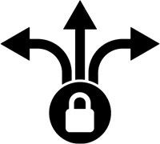

# AuthorizationInterceptor.Extensions.Redis

An interceptor for [AuthorizationInterceptor](https://github.com/Adolfok3/AuthorizationInterceptor) that uses a distributed cache with Redis to handle authorization headers.

For more information on how to configure and use, please check the main page of [AuthorizationInterceptor](https://github.com/Adolfok3/AuthorizationInterceptor).
